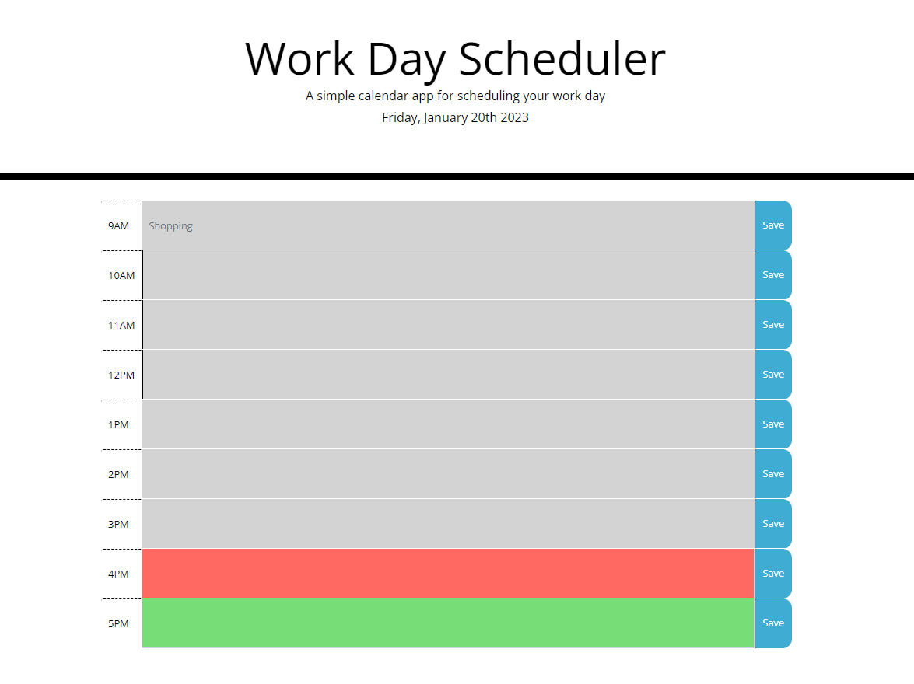
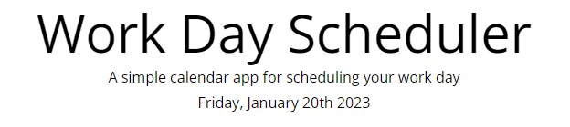
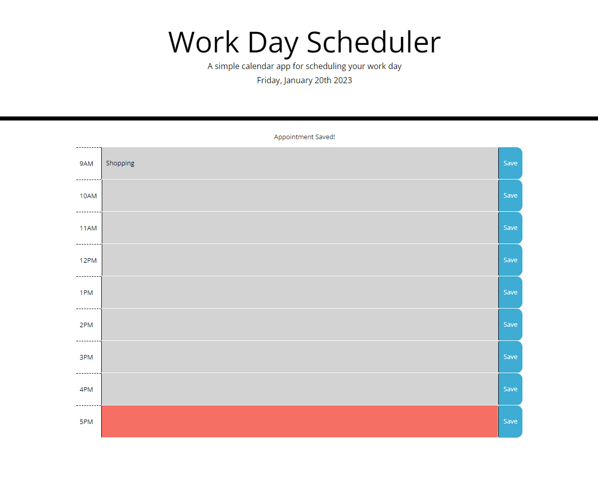

# <Work-Day-Calendar>

## Description

This project was a new opportunity for me to create a javascript file that manipulates html/css by utilising JQuery and Moment.js. The deployed application functions as a work day schedule between the hours of 9am - 5pm. Users can input appointments at each hour interval throughout the day, with the input being saved to localstorage and being kept on screen between refreshes. The CSS of the application also updates based on the time of the day(using moment.js): for the current hour the row shows as red, future hours are shown as green, and hours that have already occured show as grey.

This was a really fun build that was aided by the inclusion of bootstrap styling and components. I did have some initial issues trying to get the individual hours to change based on the time, but I realised that was easier to do by using the moment.js 24hr clock rather than the 12hr clock with am and pm included, as the 24hr clock allowed me to just use numbers in my "if... else if..." statements.

## Installation

You can view the deployed application here: https://emh93.github.io/Work-Day-Calendar/ 

## Usage

Upon opening the deployed application the user will be presented with the following page (colours shown will vary depending on the time of day when the application is opened):

The greyed our hours represent time in the day that has already passed. A red row shows the user what the current hour of the day is. A green row is an hour of the day that has yet to happen. The user can also check the current day of the week and full date as this is shown in the header of the page, as seen below:

The user can input events into the calender schedule by clicking on the desired row and typing in their appointment information. They will then need to select the blue "Save" button on that row. This will save the input to that row, and also save the information to localstorage, so that when the page is refreshed the input stays on that row until the user amends it. When a user presses save they will be alerted that their appointment has been saved by text above the schedule, as shown below:

## Credits

Starter code provided by EdX front end development bootcamp.
html content utilised from https://getbootstrap.com/ 
Time, day, date taken from Moment.js https://momentjs.com/ 

## License

MIT License